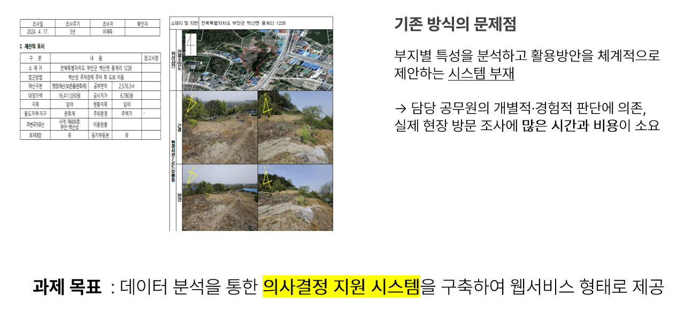
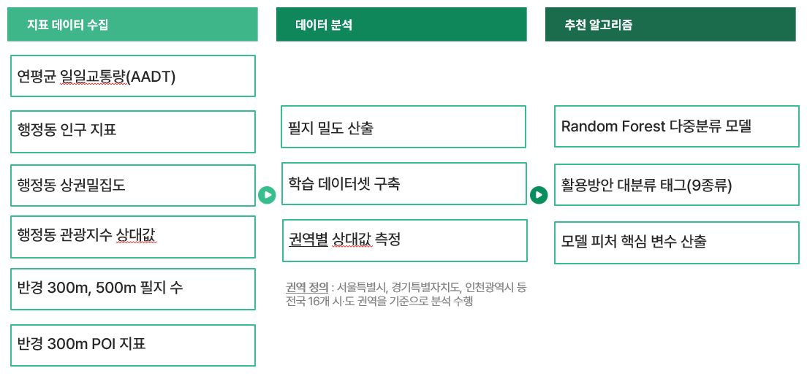
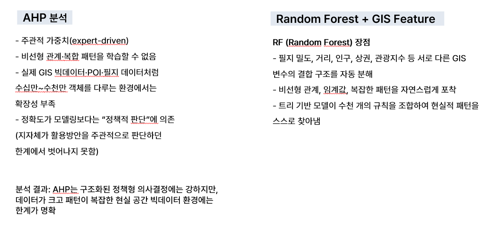

# 폐주유소 부지활용 의사결정 지원시스템 개발 (DSS)

해당 프로젝트는 **한국국토정보공사(LX)** 와의 협력으로 진행되었습니다.
<br>
프론트 깃허브 링크 : [Front-End](https://github.com/gajaeup/absolute)

<div align="center">

<table>
  <tr>
    <td align="center">
      <a href="https://github.com/sjin02">
        <br/>
        <sub><b>권서진</b></sub>
      </a>
    </td>
    <td align="center">
      <a href="https://github.com/gajaeup">
        <br/>
        <sub><b>김지애</b></sub>
      </a>
    </td>
    <td align="center">
      <a href="https://github.com/culyrh">
        <br/>
        <sub><b>박소현</b></sub>
      </a>
    </td>
    <td align="center">
      <a href="https://github.com/JinHaeunn">
        <br/>
        <sub><b>진하은</b></sub>
      </a>
    </td>
  </tr>
</table>

</div>

---

## 목적
### 전기차 보급 확대와 에너지 전환 흐름으로 증가하고 있는 폐주유소 유휴부지에 대해, 공공 데이터 기반 AI 분석을 수행하여 각 부지에 적합한 최적의 활용 유형을 자동으로 추천하는 의사결정 지원 시스템을 구축한다.


---

## 필요성
* 폐주유소의 증가로 인한 **도시 미관 저해, 환경 오염, 안전사고 위험** 등 다양한 사회적 문제가 지속적으로 발생
* 교통량, 인구, 상권, 관광 데이터 등 다양한 공공데이터가 축적되고 있음에도 이를 종합적으로 분석하여 활용하는 시스템 부재</br>



---

## 1. 구현방법

### 활용방안 데이터 기준


<br>

### 알고리즘 설계



---

## 2. 수행내용

### 국토교통부_연속지적_전국

```
LSMD_CONT_LDREG_52113_202510.shp
├── .shp   ← 공간 데이터 (geometry)
├── .dbf   ← 속성 데이터 (PNU, JIBUN, ...)
├── .shx   ← 인덱스
└── .prj   ← 좌표계 정보
```

* QGIS를 사용하여 공간 데이터 통합
* PostgreSQL DB에서 공간 데이터 베이스 구축
* PostGIS를 활용하여 공간 연산 

---

### 모델 개선



* 공간 분석으로 산출한 데이터 + 비공간 지표 => 학습 데이터셋 구성
* 랜덤 포레스트 분류기를 사용하여 도시 공간 패턴을 다수의 의사 결정 트리로 학습


### 모델 핵심 지표


---

## 3. 결과


* 주유소 마커 선택 시 표시되는 사이트 이미지


* 보고서 분석 결과 예시 (LLM 출력)

---