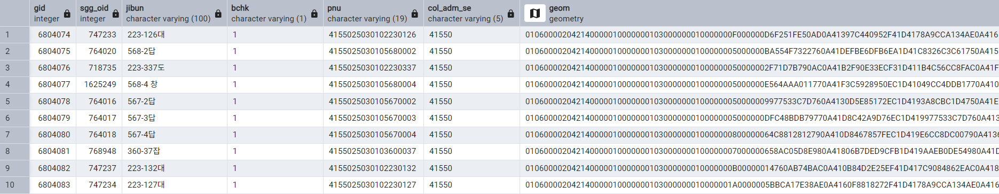

## 연속지적 필지 계산 (PostGIS)

### 국토교통부_연속지적_전국

- https://www.data.go.kr/data/15125044/fileData.do#

- 전산화된 지적도 및 임야도의 도면상 경계점을 연결하여 연속된 형태로 작성한 전국 단위의 도면정보

- 데이터 구분: 시도, 시군구

- 좌표계: **`EPSG:5186(GRS80)`**

<br>

**원본 Shapefile 구조**

```
LSMD_CONT_LDREG_52113_202510.shp
├── .shp   ← 공간 데이터 (geometry)
├── .dbf   ← 속성 데이터 (PNU, JIBUN, ...)
├── .shx   ← 인덱스
└── .prj   ← 좌표계 정보
```
**DBF 파일 내용 (속성만):**
```
PNU, JIBUN, BCHK, SGG_OID, COL_ADM_SECT_CD
4141010400109630254, 963-254도, 1, 123456, 41410
```

**SHP 파일 내용 (공간 정보):**
```
POLYGON((127.146 35.830, 127.147 35.830, ...))
```

<br>

**샘플데이터 테이블 형태**

- `PNU`: 필지 고유 번호 (필지를 전국에서 유일하게 식별하는 19자리 코드)
- `JIBUN`: 지번 (토지 주소 번호)
- `BCHK`: 산 여부 (0(일반토지), 1(산))
- `SGG_OID`: 시군구 코드(ID) (해당 토지가 속한 시군구 식별자)
- `COL_ADM_SE`: 행정구역 코드 (법정동/행정동 포함한 행정코드)

| PNU | JIBUN | BCHK | SGG_OID | COL_ADM_SE |
| --- | --- | --- | --- | --- | 
| 4812110100102520000 | 252대 | 1 | 836505 | 48120 |
| 4812110400105020001 | 502-1수 | 1 | 850728 | 48120 |
| 4812125023104520004 | 452-4 구 | 1 | 836501 | 48120 |

<br>

---

### PostGIS 데이터베이스 적재

- 약 250개의 행정동 별 지적도 파일(.shp)을 **shp2pgsql** 를 활용한 for 반복문으로 'parcels' 테이블에 배치 처리
  - `-I`: 공간 인덱스 자동 생성 (GIST index)
  - `-s 5186:4326`: EPSG:5186 → WGS84 변환
  - `-a`: append 모드 (첫 번째는 -c로 테이블 생성, 나머지는 -a)

```batch
@echo off
setlocal enabledelayedexpansion

:: PostgreSQL 연결 정보
set PGHOST=localhost
set PGPORT=5432
set PGDATABASE=absolute
set PGUSER=postgres
set PGPASSWORD={password}

:: Shapefile 디렉토리
set DATA_DIR=C:\data\parcels

:: 270개 행정동 Shapefile 순회
for /r "%DATA_DIR%" %%f in (*.shp) do (
    echo Processing: %%f
    
    :: shp2pgsql로 SQL 생성 후 psql로 DB에 삽입
    shp2pgsql -I -s 5186:4326 -a "%%f" public.parcels | psql -h %PGHOST% -U %PGUSER% -d %PGDATABASE%
    
    if !errorlevel! equ 0 (
        echo Success: %%f
    ) else (
        echo Failed: %%f
    )
)

echo All done!
pause
```

<br>

### shp2pgsql 내부 동작

- `ST_GeomFromText(text WKT, integer SRID)` : 문자열을 실제 geometry 객체로 변환하는 함수

  - WKT: 사람이 읽을 수 있는 기하 형태 표현 문자열

  - SRID: 좌표계

- `GIST(geom)`: 인덱스로 공간 검색 성능 100배 이상 향상

```sql
-- shp2pgsql이 자동 생성하는 SQL
CREATE TABLE parcels (
    gid SERIAL PRIMARY KEY,
    pnu VARCHAR(19),
    jibun VARCHAR(15),
    bchk VARCHAR(1),
    sgg_oid NUMERIC,
    col_adm_sect_cd VARCHAR(5),
    geom GEOMETRY(MULTIPOLYGON, 4326)  -- 🔴 geom 자동 추가
);

-- 데이터 삽입
INSERT INTO parcels (pnu, jibun, geom) VALUES (
    '4141010400109630254',
    '963-254도',
    ST_GeomFromText('POLYGON((127.146 35.830, ...))', 4326)  -- 🔴 SHP → geom 변환
);

-- 공간 인덱스 생성
CREATE INDEX idx_parcels_geom ON parcels USING GIST(geom);
```

- 생성된 parcels 테이블



<br>

---

### 필지 데이터 분석

`app/services/geoai_feature_engineer.py`

- `ST_Transform()`: 주유소 좌표를 PostGIS Point로 변환

```sql
WITH pts AS (
    SELECT
        id,
        ST_Transform(
            ST_SetSRID(ST_Point(lon, lat), 4326),  # ← WGS84 좌표
            5186  # ← EPSG:5186으로 변환
        ) AS geom
    FROM (VALUES
        {values_clause}
    ) AS v(id, lon, lat)
),
```

- 500m 이내 필지 찾기 (parcel_hits)
  - `ST_DWithin(geom1, geom2, 500)`: 거리 내 필지 찾기 (공간 조인)

```sql
parcel_hits AS (
    SELECT
        pts.id AS pid,
        p.geom AS parcel_geom
    FROM pts
    JOIN parcels p
      ON p.geom && ST_Expand(pts.geom, 500)  # ← 성능 최적화
     AND ST_DWithin(p.geom, pts.geom, 500)
     -- 🔴 ST_DWithin: 거리 500m 이내 필지만 조인
)
```

- 필지 개수 세기 (parcel_agg)
  - `ST_Distance(geom1, geom2)`: 정확한 거리(m) 계산

```sql
parcel_agg AS (
    SELECT
        pt.id,
        COUNT(ph.parcel_geom) FILTER (
            WHERE ST_Distance(ph.parcel_geom, pt.geom) <= 300   # 🔴 300m 이내만
        ) AS parcel_300m,
        COUNT(ph.parcel_geom) AS parcel_500m,   # 전체 개수
        MIN(ST_Distance(ph.parcel_geom, pt.geom)) AS nearest_parcel_m
    FROM pts pt
    LEFT JOIN parcel_hits ph ON pt.id = ph.pid
    GROUP BY pt.id
)
```

- DataFrame으로 변환

```python
feat_map: Dict[int, Dict] = {}
for r in rows:
    feat_map[int(r["id"])] = {
        "parcel_300m": r["parcel_300m"] or 0,      # PostgreSQL 결과
        "parcel_500m": r["parcel_500m"] or 0,      # PostgreSQL 결과
        "nearest_parcel_m": float(r["nearest_parcel_m"] or 0.0)
    }

# df.index 기준으로 다시 정렬 (없는 건 0으로 채움)
features = []
for idx in df.index:
    base = { ... }
    if idx in feat_map:
        base.update(feat_map[idx])
    features.append(base)

return pd.DataFrame(features, index=df.index)  # DataFrame 반환
```

- train.csv와 병합

```python
def run(self) -> pd.DataFrame:
    train = pd.read_csv(self.cfg.train_csv)   # 원본 train.csv
    
    df_feat = self._compute_all_features_batch(train)   # PostGIS 쿼리 실행
    
    result = pd.concat(
        [train.reset_index(drop=True), df_feat.reset_index(drop=True)],
        axis=1   # 좌우로 붙이기
    )
    
    return result   # parcel_300m, parcel_500m 포함된 DataFrame 반환
```
